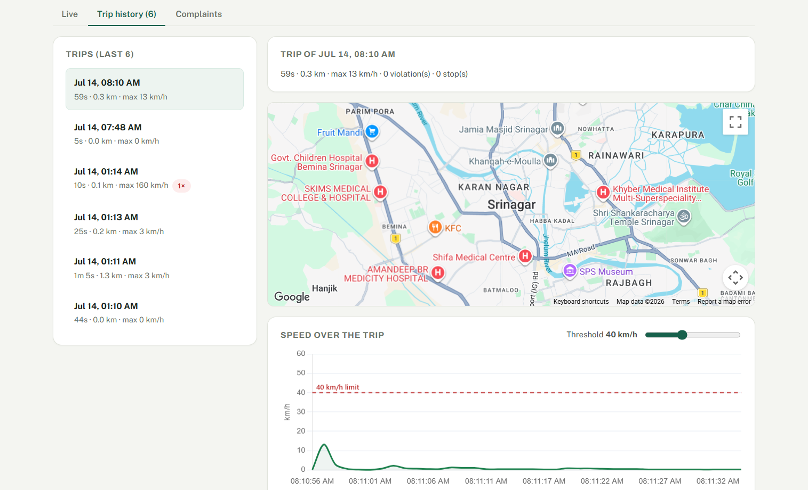
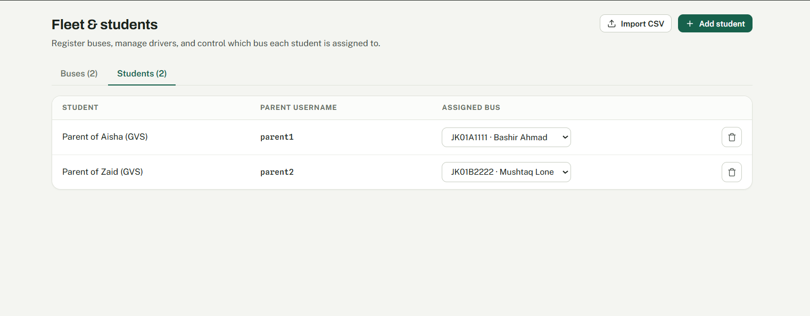
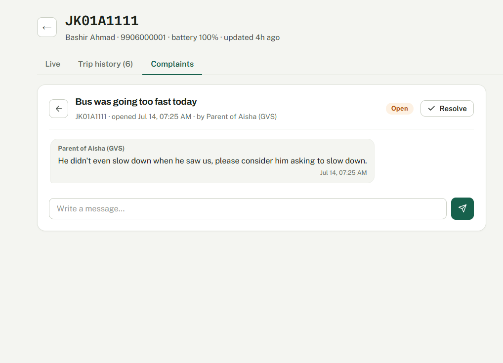
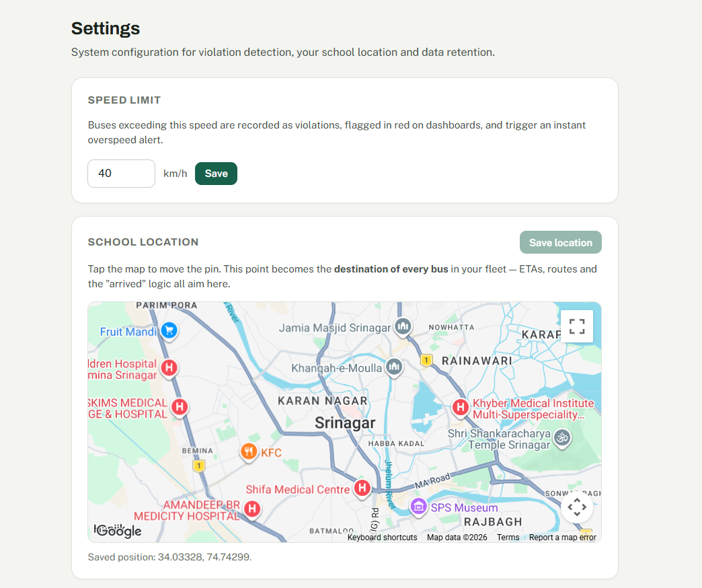

# Yemberzal

*Yemberzal* is the Kashmiri word for the narcissus — the first flower that shows up when winter ends. This project is our attempt at a small spring for school transport safety in Kashmir.

Right now, if your kid's school bus is 40 minutes late, you just stand at the pickup point and wait. Schools have no idea which of their drivers overspeed every single day, and the RTO only finds out about a rash driver after something has already gone wrong. Yemberzal puts one app on the driver's phone and gives everyone else the view they need — and *only* the view they need.

## A Quick Look

<table>
  <tr>
    <td width="50%" align="center">
      
      <br />
      <sub><b>Live tracking</b> — the bus on its route with the traveled path, plus the speed graph colored green/amber/red against an adjustable threshold line.</sub>
    </td>
    <td width="50%" align="center">
      
      <br />
      <sub><b>Fleet & students</b> — schools add buses, create parent accounts and assign each student to a bus. Bulk onboarding via CSV import.</sub>
    </td>
  </tr>
  <tr>
    <td width="50%" align="center">
      
      <br />
      <sub><b>Complaints</b> — parents open a thread, the school chats back, and resolving it with a closing note locks the conversation.</sub>
    </td>
    <td width="50%" align="center">
      
      <br />
      <sub><b>Settings</b> — the speed limit that drives violation detection, and the school's map pin, which becomes the destination for every bus in the fleet.</sub>
    </td>
  </tr>
</table>

## How it works

There are four kinds of users and one web app that adapts to each:

- **Driver** signs in with the bus plate number and taps *Start trip*. Their phone streams position/speed every second. If the network drops, points get buffered on the phone and flushed when it comes back, so nothing is lost.
- **Parent** sees their assigned bus live on the map, an ETA to the pickup pin they placed, and gets alerts (overspeed, long unexpected stops). They can also open a complaint thread with the school and chat until it's resolved.
- **School** gets a fleet dashboard — live map per bus, a speed-over-time graph with an adjustable threshold line, trip history with stops marked on the route, complaint handling, and a management page to add/remove buses, create parent accounts and assign students to buses (CSV import supported, because nobody is typing in 300 students by hand).
- **RTO** sees every registered bus across all schools with weekly violation counts, repeat-offender rankings and complaint trends — but deliberately **never** the live location. Summary-level data is enough for risk-based inspections, and tracking kids' buses centrally would be creepy. The bus is tracked, not the child.

## Running it

You need Node.js 22.13+ (or 24 LTS) — nothing else. The database is Node's built-in SQLite, and the frontend ships pre-built.

```bash
cd server
npm install
npm start
```

On Windows you can just double-click `start-windows.bat`. The console prints two URLs:

```
Laptop:             http://localhost:8080
Phones (same WiFi): https://192.168.x.x:8443
```

Open `/desktop` on the laptop (school/RTO dashboards) and `/phone` on phones (driver/parent). Phones must use the **https** address — mobile browsers only allow GPS on secure pages — and will complain about the self-signed certificate once; tap Advanced → Proceed. If phones can't reach the laptop at all, run `allow-firewall.bat` as administrator (Windows blocks inbound connections on hotspot networks by default).

For Google Maps, copy `server/.env.example` to `server/.env` and put your key in `MAPS_API_KEY`. Everything works without it too, you just get a placeholder instead of the map.

### Demo accounts

Seeded on first run (also listed on the login page — tap to autofill):

| Role   | Login       | Password    |
|--------|-------------|-------------|
| School | `gvs` / `tyndale` | `school123` |
| Driver | `JK01A1111`, `JK01B2222`, `JK05C3333`, `JK05D4444` | `driver123` |
| Parent | `parent1` … `parent4` | `parent123` |
| RTO    | `rto`       | `rto123`    |

`npm run reset-db` wipes everything back to this state.

### No bus handy? Simulate one

```bash
cd server
npm run simulate
```

This drives two virtual buses along real Srinagar roads (Hazratbal → Boulevard → school, and a Lal Chowk loop) through the *actual* driver pipeline — sockets, violations, stop detection, alerts, all of it. One of them deliberately overspeeds on Foreshore Road and takes a suspiciously long stop, so the dashboards light up properly.

## Tech notes

Node + Express + Socket.IO on the back, React (Vite) on the front, SQLite (`node:sqlite`, so zero native deps) for storage. A few decisions worth explaining:

- **Web app instead of a native driver app** — for a pilot, "open this link" beats "install this APK" every time. The socket protocol is exactly what a future Android foreground service would speak.
- **Self-signed HTTPS on the LAN** — ugly certificate warning, but it's the only way phone browsers hand over GPS without a real domain.
- **Straight-line ETA** — remaining distance / recent speed with a floor, labelled approx. Burning a Directions API call every second for a hackathon felt wrong; swapping it later means touching one function in `client/src/lib/geo.js`.
- **Data retention** — max 100 trips per bus, nothing older than 7 days, pruned automatically. Detailed movement data about school kids' buses shouldn't pile up forever.

`docs/ARCHITECTURE.md` has the full data model, socket protocol and API reference.

## What's not done (yet)

Native Android app with background tracking, push notifications for the 30/20/10-minute ETA milestones, route-deviation alerts, an SOS button, and real password hashing (it's sha256+salt right now — fine for a demo, not for production). The data layer is isolated in `server/src/db.js` so moving to MongoDB/Postgres later is a contained change.

---

Built for a hackathon, aimed at the [Safe School Bus Kashmir](docs/) pilot concept for RTO Kashmir — 5–10 schools, 25–50 vehicles, six weeks. If you're reading this from the transport department: we'd love to talk.
